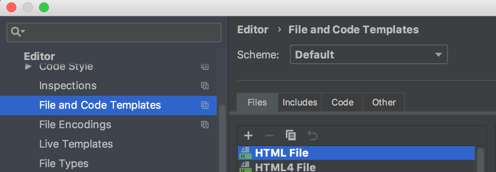
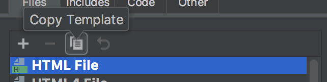
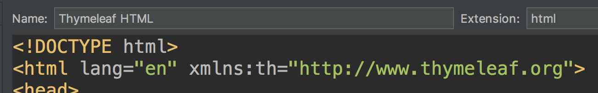
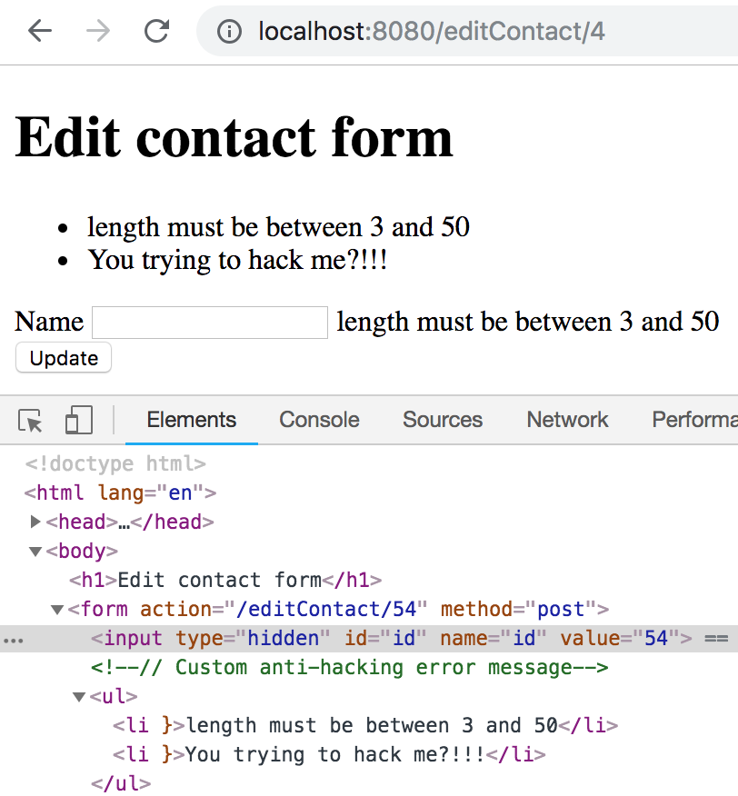

# Thymeleaf & Spring 4 - Simple Contacts App

Spring 4 and Thymeleaf used to create a simple Contacts Phone App.  

## Getting Started

IntelliJ installed

### Prerequisites 
Useful to have custom Thymeleaf based HTML IntelliJ pages.

### Installing
How to setup customisation for Thymeleaf HTML pages.
<table>
    <tr>
        <td>
             
            
Step.1 Find the default HTML5 version in the preferences

        </td>
        <td>
             
            
Step.2 Duplicate it and then rename the new copy of the file to: Thymeleaf HTML

        </td>
        <td>
             
            
Step.3 Change the 2nd line to contain the Thymeleaf reference

        </td>
    </tr>        
</table>

## Running the tests
 
Interesting anti-hacking implementation, preventing users from submitting false data through the form.

## Built With

* [Tomcat plugin](https://mvnrepository.com/artifact/org.apache.tomcat/tomcat-jdbc) - Server plugin
* [Thymeleaf](https://www.baeldung.com/thymeleaf-in-spring-mvc) 
* [MySQL](https://www.mysql.com/) - MySQL database

## Authors

* **Ryan Alexander** - *Junior Java Developer* - [LinkedIn](https://www.linkedin.com/in/rememberryan/)

## Acknowledgments

* SDA